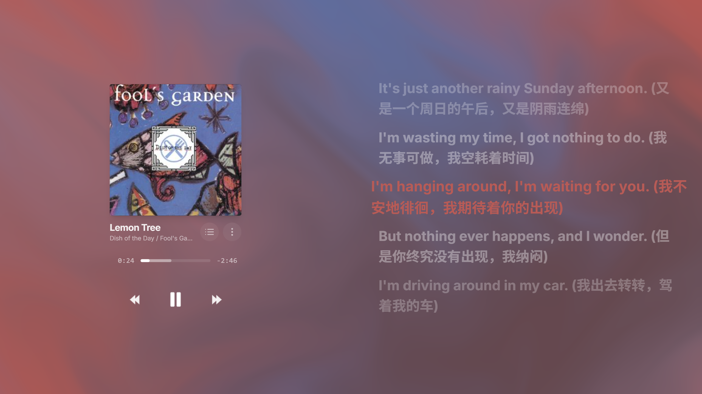
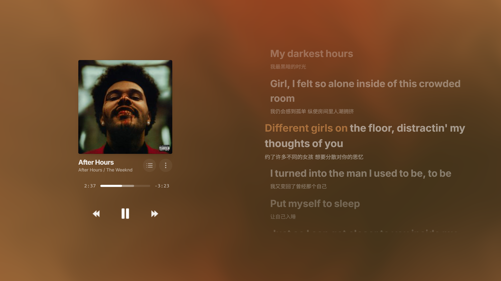

<div align="center">


# Lumison

**A Minimalist Music Player with Immersive Visuals**

[](https://opensource.org/licenses/MIT)
[](https://tauri.app/)
[](https://react.dev/)
[](https://www.typescriptlang.org/)
[](https://vite.dev/)

[Live Demo](https://salixfrost.github.io/lumison/) • [Download](https://github.com/SalixJFrost/Lumison/releases) • [Documentation](docs/README.md)

</div>

---

## ✨ Features

- **Multi-Source Music**: Local files, Online Music Search (Netease), Internet Archive, Album Search
- **Immersive Visuals**: Dynamic shader background (Gradient, Fluid, Melt modes)
- **Synchronized Lyrics**: Word-by-word highlighting with auto-scroll
- **Desktop Experience**: Tauri 2.0 with keyboard shortcuts and auto-updates
- **Focus Mode**: Pomodoro-style focus session timer
- **Internationalization**: English and Chinese language support

---

## 📸 Screenshots

<div align="center">





</div>

---

## 🚀 Quick Start

### Web Version

Visit [Lumison Web Demo](https://salixfrost.github.io/lumison/) and start playing music

### Desktop App

Download from [GitHub Releases](https://github.com/SalixJFrost/Lumison/releases)

### Build from Source

```bash
git clone https://github.com/SalixJFrost/Lumison.git
cd Lumison
npm install
npm run tauri:build
```

---

## 📖 Documentation

For detailed documentation, see:
- [English Documentation](docs/README.md)
- [中文文档](docs/README.zh-CN.md)

---

## 🛠️ Tech Stack

| Component | Technology |
|-----------|-----------|
| Frontend | React 19, TypeScript 5.8, Vite 6 |
| Styling | Tailwind CSS 3.4 |
| Animation | @react-spring/web |
| Desktop | Tauri 2.0, Rust |
| Testing | Vitest |

---

## 📄 License

MIT License - see [LICENSE](LICENSE) for details

---

<div align="center">

Made with ❤️ using React + Tauri

</div>
